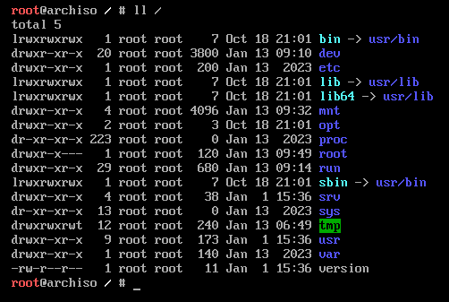

# Arch


## 安装包准备

[官网介绍][官网介绍]

[官方下载地址][官方下载地址]

## 简单安装

我们进入到 Arch 的安装后 , 默认是以一个 root 身份登录的 **虚拟控制台** , 我们需要再这个控制台内进行 磁盘的分区 , 基础软件的安装 , 镜像源的替换 , 系统的安装 , 等等

### 查看当前的 引导模式

```sh
# 如果命令结果显示了目录且没有报告错误，则系统以 UEFI 模式引导。 如果目录不存在，则系统可能以 BIOS 模式 (或 CSM 模式) 引导。如果系统未以您想要的模式引导启动，请参考您的主板说明书。
ls /sys/firmware/efi/efivars

# 如果是 Vmware 虚拟机 需要在 虚拟机->设置->选项->高级->固件类型->UEFI

# 如果是 实体机 需要在 主板的 BIOS 中修设置为允许 UEFI 启动
```


### 创建并挂载分区

我们进入 Arch 的 虚拟控制台后 可以查看如下目录 , 这儿需要关注的是 `/mnt` `/dev`  两个目录:

​	`/mnt` : 最终 Arch 系统会安装到该目录中.

​	`/dev` : 主要是作为访问外部设备文件的几口 , 比如我们的 数据盘 , 外接的磁盘 , U盘 , 我们需要安装系统的盘.




​	我们最终的系统是会安装到 /mnt 目录中 , 因此我们需要对 , 已有的磁盘进行分区 , 然后将去挂在到 /mnt  上指定的目录中

```sh
# 查看当前系统的 目录结构 以及 大小
df -h

# 查看当前系统 可识别的数据盘
fdisk -l

# 找到 我们需要 进行分区的 数据盘 对应的接口路径
fdisk /dev/sda

# 可以使用 m 来查看各个选项的含义 , 依次输入 n , p , 回车 , 回车 , +2G , 回车 来创建一个 2GB 的分区 , 可以使用该方法来创建 4 个主分区  具体分区 大小 参考如下 表 , 四个 分区创建完成后 可以输入 i 来查看创建信息 , 输入 w 来保存分区表并退出.

# 分区创建完毕后 需要对分区进行 格式化
# 格式化系统分区
mkfs.fat -F32 /dev/sda1
# 格式化交换分区
mkswap /dev/sda2
# 格式化根目录
mkfs.ext4 /dev/sda3
# 格式化家分区
mkfs.ext4 /dev/sda4

# 挂载分区一定要遵循顺序，先挂载根（root）分区（到 /mnt），再挂载引导（boot）分区（到 /mnt/boot)
# 挂载 根 目录
mount /dev/sda3 /mnt
# 挂载系统分区
mkdir /mnt/boot
mount /dev/sda1 /mnt/boot
# 交换空间 无需挂载 , 但需要启用
swapon /dev/sda2
# 挂载 家 目录
mkdir -p /mnt/home
mount /dev/sda4 /mnt/home

# 显示挂载后的 4 个分区
lsblk

sda     8:0   0  250G  0 disk
├─sda1 8:1    0    2G  0 part /mnt/boot
├─sda2 8:2    0    8G  0 part [SWAP]
├─sda3 8:3    0  190G  0 part /mnt
├─sda4 8:4    0   50G  0 part /mnt/home

# 用以下命令生成 fstab 文件 (用 -U 或 -L 选项设置 UUID 或卷标)
# fstab 文件可用于定义磁盘分区，各种其他块设备或远程文件系统应如何装入文件系统。
mkdir /mnt/etc
genfstab -U /mnt >> /mnt/etc/fstab
# 检查是否正确，文件系统被正确挂载
cat /mnt/etc/fstab
```

| 挂载路径                           | 分区路径  | 分区类型                                         | 建议大小               |
| ---------------------------------- | --------- | ------------------------------------------------ | ---------------------- |
| /mnt/boot/efi                      | /dev/sda1 | EFI 系统分区                                     | 至少 300 MB (推荐 1GB) |
| 交换空间路径 无需挂载 , 但需要启用 | /dev/sda2 | Linux 系统 交换空间 目录                         | 大于 512 MB (推荐 4GB) |
| /mnt                               | /dev/sda3 | Linux 系统 `/` 根目录                            | 最好 30 GB 以上        |
| /mnt/home                          | /dev/sda4 | Linux 系统 `/home` 家目录 , 创建用户所使用的目录 | 剩余空间               |


### 切换镜像源并安装基础软件

​	文件 `/etc/pacman.d/mirrorlist` 定义了软件包会从哪个镜像下载。在 LiveCD 启动的系统上，在连接到互联网后，reflector 会通过选择 20 个最新同步的 HTTPS 镜像并按下载速率对其进行排序来更新镜像列表。

​	在列表中越前的镜像在下载软件包时有越高的优先权。您或许想检查一下文件，看看是否满意。如果不满意，可以相应的修改 `/etc/pacman.d/mirrorlist` 文件，并将地理位置最近的镜像源挪到文件的头部，同时也应该考虑一些其他标准。

​	这个文件接下来还会被 *pacstrap* 拷贝到新系统里，所以请确保设置正确。

[切换清华镜像源][切换清华镜像源]

```sh
# 编辑文件 /etc/pacman.d/mirrorlist
vim /etc/pacman.d/mirrorlist
# 在文件的最顶端添加
Server = https://mirrors.tuna.tsinghua.edu.cn/archlinux/$repo/os/$arch

# 保存退出 更新软件包缓存
sudo pacman -Syy

# 安装必须的软件包 , 主要是 base 包 与 Linux内核以及常规硬件的固件
pacstrap -K /mnt base linux linux-firmware base-devel vim
# 安装 zen内核 即高性能内核 , 但是不支持 nvidia 显卡 
# pacstrap -K /mnt linux-zen linux-zen-headers base-devel vim
```


### 切换到 需要安装的系统中

```sh
# Chroot意为Change root，相当于把操纵权交给我们新安装（或已经存在）的Linux系统，执行了这步以后，我们的操作都相当于在磁盘上新装的系统中进行。如果以后我们的系统出现了问题，只要插入U盘并启动， 将我们的系统根分区挂载到了/mnt下（如果有efi分区也要挂载到/mnt/boot下），再通过这条命令就可以进入我们的系统进行修复操作。
arch-chroot /mnt

# 接下来我们便进入了 新系统
# 并且下面的所有的步骤 都是在这个新系统中进行 
# 可以输入 exit 退出到 archIos 上的 Live 系统 , 也可以使用 arch-chroot /mnt 切换到我们的新系统
```

#### 配置系统

```sh
# 设置 时区 , 以上海为例
ln -sf /usr/share/zoneinfo/Asia/Shanghai /etc/localtime
# 生成 /etc/adjtime
hwclock --systohc

# 设置 本地化
# 编辑 /etc/locale.gen
vim /etc/locale.gen
# 找到 zh_CN.UTF-8 UTF-8  en_US.UTF-8 UTF-8  这两行，去掉行首的#号，保存并退出
# 更新
locale-gen
# 创建 locale.conf 文件 并编辑设定 LANG 变量
vim /etc/locale.conf
# 添加
LANG=en_US.UTF-8


# 网络配置
vim /etc/hostname
# 在文件的第一行输入你自己设定的一个myhostname,这个myhostname就是计算机名
# 添加对应的信息到 hosts
vim /etc/hosts
# 添加如下内容（将myhostname替换成你自己设定的主机名）
127.0.0.1    localhost
::1          localhost
127.0.1.1    myhostname.localdomain    myhostname

# 配置 root 用户密码 , 输入两次 root 用户的密码
passwd
```

#### 安装引导程序 

```sh
# 这一步 我们依然在 新系统中 而不是退出到 archIso 系统内
pacman -S grub efibootmgr
# 创建我们 grub 引导目录
mkdir /boot/grub
# 生成默认配置文件
grub-mkconfig -o /boot/grub/grub.cfg
# 安装引导程序
mkdir /boot/efi
grub-install --target=x86_64-efi --boot-directory=/boot --efi-directory=/boot/efi --bootloader-id=GRUB
# 如果系统不支持 UEFI 方式引导 , 则改为 BIOS 方式引导
# grub-install --target=i386-pc /dev/sda/
```


---

[官网介绍]:https://archlinux.org/
[官方下载地址]:https://archlinux.org/download/
[切换清华镜像源]:https://mirrors.tuna.tsinghua.edu.cn/help/archlinux/

