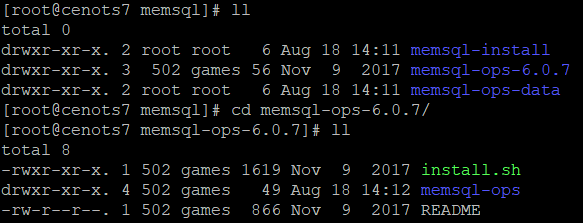

# 安装 RapidsDB 4.2.3 （两个节点）


## 安装环境


安装环境为 [BUTP](http://butp.boraydata.com:8888/#/dashboard) 上申请的两台主机，参数 [`系统：Centos7.9.2009  CPU核心：8   内存：8GB` ]

1. 一台准备作为 RapidsDB 的**主节点**
    - IP：**192.168.30.200**
    - netmask：255.255.255.0
    - Gateway：192.168.30.1
    - 使用的安装用户：root
2. 一台准备作为 RapidsDB 的**从节点**
    - IP：**192.168.30.155**
    - netmask：255.255.255.0
    - Gateway：192.168.30.1
    - 使用的安装用户：root
3. **主、从 节点** 都进行了 [系统调整与优化](#系统调整与优化) {关闭透明巨页、调整内核、禁用防火墙、配置免密登陆}


-   主节点 所准备的安装包


-   从节点 所准备的安装包，由于 RapidsDB 主节点会根据配置文件，使用 SSH 远程在从节点进行安装。


## 安装包来源

-   [NTP服务](#安装 NTP 服务)


| 文件                                         | 地址                                                   |
| -------------------------------------------- | ------------------------------------------------------ |
| `autogen-libopts-5.18-5.el7.x86_64.rpm`      | [下载地址][autogen-libopts-5.18-5.el7.x86_64.rpm]      |
| `ntpdate-4.2.6p5-29.el7.centos.2.x86_64.rpm` | [下载地址][ntpdate-4.2.6p5-29.el7.centos.2.x86_64.rpm] |
| `ntp-4.2.6p5-29.el7.centos.2.x86_64.rpm`     | [下载地址][ntp-4.2.6p5-29.el7.centos.2.x86_64.rpm]     |

-   [JDK](#安装 JDK)

| 文件                         | 地址                                   |
| ---------------------------- | -------------------------------------- |
| `jdk-8u171-linux-x64.tar.gz` | [下载地址][jdk-8u171-linux-x64.tar.gz] |

-   [Zookeeper](#安装 Zookeeper)

| 文件                      | 地址                                |
| ------------------------- | ----------------------------------- |
| `zookeeper-3.4.12.tar.gz` | [下载地址][zookeeper-3.4.12.tar.gz] |

-   [RapidsDB 4.2.3](#RapidsDB 4.2.3 集群 搭建与配置)

| 文件                                | 内部文件服务器中的地址                        |
| ----------------------------------- | --------------------------------------------- |
| `rdp-installer-R4.2.3-ga28c15b.run` | [下载地址][rdp-installer-R4.2.3-ga28c15b.run] |
| `rapids.lic`                        | [下载地址][rapids.lic]                        |

-   [MemSQL](#安装 MemSQL)

| 文件                      | 地址                                |
| ------------------------- | ----------------------------------- |
| `memsql-ops-6.0.7.tar.gz` | [下载地址][memsql-ops-6.0.7.tar.gz] |
| `memsqlbin_amd64.tar.gz`  | [下载地址][memsqlbin_amd64.tar.gz]  |


----


## 系统调整与优化

### 一、关闭透明巨页

Linux 下的大页分为两种类型：标准大页（Huge Pages）和透明大页（Transparent Huge Pages）。这两者的区别在于大页的分配机制，标准大页管理是预分配的方式，而透明大页管理则是动态分配的方式。目前透明 大页与传统大页混合使用会出现一些问题，导致性能问题和系统重启。

1. 修改配置文件

```sh
vi /etc/rc.d/rc.local
```

```sh
# 在配置文件末尾添加如下的代码
for f in /sys/kernel/mm/*transparent_hugepage/enabled; 
do if 
    test -f $f; then echo never > $f; 
fi done
for f in /sys/kernel/mm/*transparent_hugepage/defrag; 
do if 
    test -f $f; then echo never > $f; 
fi done
```

2. 授予权限

```sh
chmod +x /etc/rc.d/rc.local
```

3. **重启** 使修改的配置文件生效


```sh
reboot
```


### 二、内核参数调整

在正式安装配置集群前，需要对节点的内核参数进行配置，以达到最好数据传输的效果，集群内所有节点均需要进行如下配置，请参考下面的配置步骤

1. 修改系统文件

```sh
vi /etc/sysctl.conf
```

```sh
# 该参数表示可以使用的文件句柄最大数量,也就是可以打开最多的文件数量
fs.file-max = 3145680

# 表示每一个real user ID可创建的inotify instatnces的数量上限
fs.epoll.max_user_instances = 8192

# 表示同一用户同时可以添加的watch数目（watch一般是针对目录，决定了同时同一用户可以监控的目录数量）
fs.inotify.max_user_watches = 16384

# 单个 jvm 能开启的最大线程数
vm.max_map_count = 1048560
```

2. 然后执行命令使其生效


```sh
sysctl -p
```

3. 接下来进行 limit 调优


```sh
vi /etc/security/limits.conf
```

```sh
# 配置文件后追加 root 为，安装运行 RapidsDB 的用户，也可以替换为 *
root soft nproc 1045680
root hard nproc 1045680
root soft nofile 1045680
root hard nofile 1045680
```

```sh
vi /etc/security/limits.d/20-nproc.conf
```

```SH
#配置文件后追加
root soft nproc 1045680
root hard nproc 1045680
root soft nofile 1045680
root hard nofile 1045680
```


### 三、禁用防火墙

这一步的目的是由于 Zookeeper 服务、RapidsDB 服务 等所使用的端口需要在防火墙中开启，为了避免后续繁琐的操作，这儿暂且永久关闭防火墙。

1. 显示防火墙状态

```SH
systemctl status firewalld
```

2. 永久关闭防火墙

```sh
systemctl disable firewalld
```


其他命令


- 暂时关闭防火墙

```sh
systemctl stop firewalld
```


### 四、配置节点间免密登录

由于后续安装 RapidsDB 集群，是在主节点上通过 SSH 的方式，将相关安装文件发派到 从节点上，并通过 shell 命令安装，因此需要申请节点间的免密登陆，来确保安装脚本能稳定进行。

1. 创建 SSH 密钥

    ```sh
    ssh-keygen -t rsa
    ```

   在连续的回车确认后，会在 `~/.ssh` 路径下生成公钥与私钥。

2. 在各个节点上 配置 免密登录

    -  登陆 192.168.30.200 (主节点) 主机，执行如下命令

    ```sh
    cd ~/.ssh/
    ssh-copy-id root@192.168.30.200
    ssh-copy-id root@192.168.30.155
    ```

    -  登陆 192.168.30.155 （从节点） 主机，执行如下命令
    
    ```sh
    cd ~/.ssh/
    ssh-copy-id root@192.168.30.200
    ssh-copy-id root@192.168.30.155
    ```


### 五、配置节点映射

1.  节点 192.168.30.200 上进行如下配置

```sh
# 修改 host 映射配置
vi /etc/hosts
    # 添加以下内容
    192.168.30.200 node1
    192.168.30.155 node2
###################################
# 修改当前 节点主机名
vi /etc/hostname
    # 添加
    node1
# 修改当前 节点主机名
hostname node1
```

2.  节点 192.168.30.155 上进行如下配置

```sh
# 修改 host 映射配置
vi /etc/hosts
    # 添加以下内容
    192.168.30.200 node1
    192.168.30.155 node2
###################################
# 修改当前 节点主机名
vi /etc/hostname
    # 添加
    node2
# 修改当前 节点主机名
hostname node2
```


---


## 安装 NTP 服务

NTP 是网络时间协议（Network Time Protocol），由于RapidsDB是 MPP （大规模并行处理结构） 架构的数据库，必须要求整个集群的所有的节点的系统时钟保持同步。也就是集群中应该选择 一个节点作为时钟同步的基准，一般我们使用的是主节点作为时钟同步的基准。如果不是安装 RapidsDB 集群，那么无需安装 NTP 服务。

**在线安装**

-   简便安装 可直接使用 如下命令 ，在线安装成功后，对各个节点进行相应的配置即可，[服务端配置](#服务端修改配置文件)  [客户端配置](#客户端修改配置文件)。

```sh
yum -y install ntp
```


**离线手动安装**

需要准备 如下安装文件：


- `autogen-libopts-5.18-5.el7.x86_64.rpm`  ： 安装 NTP 服务所需要的依赖，官方介绍这是一个命选项解析器。[下载地址][autogen-libopts-5.18-5.el7.x86_64.rpm]
- `ntpdate-4.2.6p5-29.el7.centos.2.x86_64.rpm` ： 可以通过 ntpdate 命令 **手动** 的与指定的 服务器同步时间，ep：`ntpdate -q ntp.aliyun.com` 。[下载地址][ntpdate-4.2.6p5-29.el7.centos.2.x86_64.rpm]
- `ntp-4.2.6p5-29.el7.centos.2.x86_64.rpm` ： 服务端 发布 NTP 服务所必备的，也可以通过相关配置文件 **自动** 同步时间。[下载地址][ntp-4.2.6p5-29.el7.centos.2.x86_64.rpm]

安装 NTP 服务，也有多种方案：


> 方案一：将 A 主机 作为 NTP 服务器，其余的主机为客户机。只需安装 ntpdate 服务，通过命令来同步主机 A 的时间。亦可安装整个 NTP 服务，自动来同步时间。
>
> 方案二：若已有 时间同步 服务器，则主机可以只安装 ntpdate 服务，通过命令来同步时间服务器时间。亦可安装整个 NTP 服务，自动来同步时间。

这儿我采用的是方案一，并使用离线手动安装的方式，相关的 RPM 文件除了上述提供的链接 也可以在下面网站中查找，安装不同版本。

[PRM 下载 1](https://pkgs.org/)  [PRM 下载 2](http://www.rpmfind.net/linux/)


### 服务端

清理系统自带的 NTP 包

```sh
rpm -qa | grep ntp  
```

如果有相关的包，需要通过 `yum -y remove packname` 来卸载


####  手动安装

1. 进入我们 下载的 软件包目录


```sh
cd /usr/local/download/ntp
```

2. 先安装依赖  (ntp 服务 需要安装 以下两个依赖)

```sh
rpm -ivh autogen-libopts-5.18-5.el7.x86_64.rpm
 
rpm -ivh ntpdate-4.2.6p5-29.el7.centos.2.x86_64.rpm
```

若不安装依赖，直接安装 NTP服务 便会报错


3. 然后安装 NTP 服务

```sh
rpm -ivh ntp-4.2.6p5-29.el7.centos.2.x86_64.rpm
```

4. 查看 是否安装完成

```sh
rpm -qa | grep ntp
```


#### 服务端修改配置文件

通过 `ifconfig` 与 `route -n` 命令可查看本机的 IP 与 Gateway ，若相关命令 请安装 `yum install net-tools`

IP： **192.168.30.200**

Netmask：255.255.255.0

Gateway：192.168.30.1

```sh
vi /etc/ntp.conf
```

```sh
# 第 12 行后面添加如下信息：其中 192.168.30.200 为本机节点的 IP 地址
restrict 192.168.30.200 nomodify notrap nopeer noquery
restrict 127.0.0.1
restrict ::1

# 第 17 行将原 restrict 192.168.1.0 修改成为网关地址 192.168.30.1
# 修改前 ：
restrict 192.168.1.0 mask 255.255.255.0 nomodify notrap
# 修改后：
restrict 192.168.30.1 mask 255.255.255.0 nomodify notrap

# 第 21-24 行注释掉 : 注释掉上级时间服务器地址
#server 0.centos.pool.ntp.org iburst
#server 1.centos.pool.ntp.org iburst
#server 2.centos.pool.ntp.org iburst
#server 3.centos.pool.ntp.org iburst

# 在原 24 行后面添加信息：外部时间服务器不可用时，以本地硬件时间提供时间服务
# 至于为什么是 127.127.1.0 可以查看官网 Clock Support Overview 相关的内容
# https://doc.ntp.org/documentation/4.2.0/notes/
# 官方文档 使用的是 fudge，但是我使用却报错，改为 Fudge 则正常
server 127.127.1.0
Fudge 127.127.1.0 stratum 10
```


#### 启动服务

```sh
systemctl restart ntpd.service
```

#### 验证 NTP 是否连通

```sh
ntpstat
```


### 客户端

这儿我们是让其自动更新时间，因此需要安装整个 NTP 服务，请参考 [服务端的安装流程](#手动安装) ，安装完成后我们只需要修改其配置文件即可。

#### 客户端修改配置文件

通过 `ifconfig` 与 `route -n` 命令可查看本机的 IP 与 Gateway ，若无此命令 请 `yum install net-tools`

IP： **192.168.30.155**

Netmask：255.255.255.0

Gateway：192.168.30.1

```sh
vi /etc/ntp.conf
```

```sh
#第12行后面添加如下信息：其中 192.168.30.155 为本机节点的IP地址
restrict 192.168.30.155 nomodify notrap nopeer noquery
restrict 127.0.0.1
restrict ::1

#第17行将原 restrict 192.168.1.0 修改成为网关地址 192.168.30.1
# 修改前：
restrict 192.168.1.0 mask 255.255.255.0 nomodify notrap
# 修改后：
restrict 192.168.30.1 mask 255.255.255.0 nomodify notrap

# 第 21-24 行注释掉 : 注释掉上级时间服务器地址
# server 0.centos.pool.ntp.org iburst
# server 1.centos.pool.ntp.org iburst
# server 2.centos.pool.ntp.org iburst
# server 3.centos.pool.ntp.org iburst

# 在原 24 行后面添加信息：上级时间服务器地址
server 192.168.30.200
Fudge 192.168.30.200 stratum 10
```

#### 启动服务

```sh
systemctl start ntpd.service
```

#### 验证 NTP 是否连通

```sh
ntpstat
```

客户端验证时可能出现

```sh
[root@cenots7 download]# ntpstat
unsynchronised  time server re-starting   polling server every 8 s
```

这种情况属于**正常**，ntp 服务器配置完毕后，需要**等待 5-10 分钟**才能与 `/etc/ntp.conf` 中配置的标准时间进行同步。

```sh
[root@cenots7 download]# ntpstat
synchronised to NTP server (192.168.30.200) at stratum 7   time correct to within 26 ms   polling server every 128 s
```

#### 查看时间同步状态

```sh
ntpq -p
```

```sh
[root@cenots7 download]# ntpq -p     
     remote           refid      st t  when poll reach   delay   offset  jitter
==============================================================================
192.168.30.200     LOCAL(0)      6  u   99  128  377    0.217   -0.211   0.045
```


remote：本机和上层ntp的ip或主机名，“+”表示优先，“*”表示次优先

refid：参考上一层ntp主机地址

st：stratum阶层

when：多少秒前曾经同步过时间

poll：下次更新在多少秒后

reach：已经向上层ntp服务器要求更新的次数

delay：网络延迟

offset：时间补偿

jitter：系统时间与bios时间差


[ntpdate-4.2.6p5-29.el7.centos.2.x86_64.rpm]:http://mirror.centos.org/centos/7/os/x86_64/Packages/ntpdate-4.2.6p5-29.el7.centos.2.x86_64.rpm
[ntp-4.2.6p5-29.el7.centos.2.x86_64.rpm]:http://www.rpmfind.net/linux/centos/7.9.2009/os/x86_64/Packages/ntp-4.2.6p5-29.el7.centos.2.x86_64.rpm

[autogen-libopts-5.18-5.el7.x86_64.rpm]:http://www.rpmfind.net/linux/centos/7.9.2009/os/x86_64/Packages/autogen-libopts-5.18-5.el7.x86_64.rpm


----


## 安装 JDK

由于 RapidsDB 大部分是使用 Java 实现的，因此需要安装 JDK 环境。

-   `jdk-8u171-linux-x64.tar.gz`：[下载地址][jdk-8u171-linux-x64.tar.gz]

### 准备工作

1. 查看已经安装的OpenJDK包：


```shell
rpm -qa | grep java
```

2. 如果有相关的包，需要通过 `yum -y remove` 命令来将以 `java`开头的安装包均卸载


```shell
yum -y remove java-1.7.0-openjdk-1.7.0.141-2.6.10.5.el7.x86_64
yum -y remove java-1.8.0-openjdk-1.8.0.131-11.b12.el7.x86_64
······
```

mkdir 

### 创建目录并解压

1. 创建我们的java文件夹

```shell
mkdir /usr/local/java
```

2. 将我们的安装包解压到 `/usr/local/java` 中

```shell
cd /usr/local/java
tar -zxvf /usr/local/download/jdk-8u171-linux-x64.tar.gz -C ./
```

3. 解压完成后 我们的 `usr/local/java` 文件夹中会多一个 `jdk1.8.0_171`的目录


### 环境的配置

1. 编辑 `/etc/profile` 文件，在尾部添加 如下 JDK 环境，该环境为 **全局变量**。

```sh
######################   JAVA    #####################
JAVA_HOME=/usr/local/java/jdk1.8.0_171
CLASSPATH=$JAVA_HOME/lib/
PATH=$PATH:$JAVA_HOME/bin
```

2. 执行如下命令 让环境变量生效

```sh
source /etc/profile
```


==！！！！！！  注意    ！！！！！！！！==


- 上面方法配置的是全局环境变量，当使用 Python 或 Jenkins 登陆 ssh 客户端时，使用的 shell 是 csh、tcsh、zsh 等，**并不会加载全局环境变量**，而是加载 用户目录的 `.bashrc` 文件，所以我们也可以**将上述环境变量添加到 常用 ssh 用户的 `.bashrc` 文件中**。[参考](https://superuser.com/questions/183870/difference-between-bashrc-and-bash-profile/183980#183980)

    - 简单来说就是 non-login shell 与 login shell 获取的环境变量不同导致的，而 RDB 操作集群各节点使用的是 non-login shell 方式，一般来说 non-login shell则只会读取**~/.bashrc**这一个文件，因此不回去加载 **/etc/profile** 中的 Java 环境变量。


- 亦可在上述 shell 中加入 `bash -lc` 命令来运行，例如：

    ```sh
    # ssh 192.168.30.155 "bash -lc 'java -version'"
    
    ```

ssh 192.168.30.155 "java -version"
    ```
    
    

### 验证 JDK 安装结果

输入如下命令 即可查看安装结果：

```sh
java -version

javac
```


[jdk-8u171-linux-x64.tar.gz]:https://repo.huaweicloud.com/java/jdk/8u171-b11/jdk-8u171-linux-x64.tar.gz


----


## 安装 Zookeeper

ZooKeeper 是一个分布式的，开放源码的分布式应用程序协调服务，是 Google的 Chubby 一个开源的实现，在集群中起到集群管理的功能。RapidsDB 4.2.3 中主要用 Zookeeper 进行 RapidsDB 集群的配置管理。

-   `zookeeper-3.4.12.tar.gz`：[下载地址][zookeeper-3.4.12.tar.gz]

### 创建目录

```sh
mkdir -p /usr/local/zookeeper/data
cd /usr/local/zookeeper
```

### 解压 安装包 

```sh
tar -vxzf /usr/local/download/zookeeper-3.4.12.tar.gz -C ./
```

### 修改 zookeeper 配置文件

```sh
cd /usr/local/zookeeper/zookeeper-3.4.12/conf/
cp zoo_sample.cfg zoo.cfg
vi zoo.cfg
```

```sh
# 修改第 12 行的内容
dataDir=/usr/local/zookeeper/data


# 在结尾添加 如下信息
# Set to "0" to disable auto purge feature
#autopurge.purgeInterval=1
# 部署高可用集群时需要在这儿 声明相关节点 并 配置 ServerID
server.1=192.168.30.200:2888:3888
server.2=192.168.30.155:2888:3888
```

**server.A=B:C:D** 中的A是一个数字,表示这个是第几号服务器,B是这个服务器的IP地址，C第一个端口用来集群成员的信息交换,表示这个服务器与集群中的leader服务器交换信息的端口，D是在leader挂掉时专门用来进行选举leader所用的端口。


### 创建 ServerID 标识

需要 添加 服务标识文件， 这个文件里面有一个数据就是A的值（该A就是zoo.cfg文件中server.A=B:C:D中的A）。

- 在 192.168.30.200 主机上配置

```sh
echo "1" > /usr/local/zookeeper/data/myid
```

- 在 192.168.30.155 主机上配置

```sh
echo "2" > /usr/local/zookeeper/data/myid
```


### 启动服务

```sh
cd /usr/local/zookeeper/zookeeper-3.4.12/
./bin/zkServer.sh start
```


### 其他命令

-   关闭服务

```sh
./bin/zkServer.sh stop
```

-   查看是否监听端口

在使用 Zookeeper 集群时，若没有配置 ServerID 标识，使用 `zkServer.sh start` 并不会报错，因此需要查看 Zookeeper 有没有监听相应的端口。

```sh
netstat -nap | grep 2181
```

-   查看服务状态

```sh
./bin/zkServer.sh status
```

-   使用客户端链接

```sh
./bin/zkCli.sh -server 192.168.30.155:2181
```

-   使用如下命令查看日志

```sh
 ./zkServer.sh start-foreground
```


[zookeeper-3.4.12.tar.gz]:https://archive.apache.org/dist/zookeeper/zookeeper-3.4.12/zookeeper-3.4.12.tar.gz


---


##  RapidsDB 4.2.3 集群 搭建与配置


！！！！！！！！！！！！！！！！！  **安装前注意事项**    ！！！！！！！！！！！！！！！！！！！！！！！

1.  Zookeeper **各节点之间可以互相链接  并启动Zookeeper服务**

2.  配置 **ssh 免密登录**

3.  验证环境变量是否加载成功

  ```sh
ssh 192.168.30.155 'java -version'
  ```

4.  验证节点上是否可以创建目录 

  ```sh
ssh 192.168.30.155 'mkdir /usr/local/rapidsDB'
  ```


-   `rdp-installer-R4.2.3-ga28c15b.run`：暂且只尝试了该安装包。[下载地址][rdp-installer-R4.2.3-ga28c15b.run]

-   `rapids.lic`：这是安装包对应的所需认证文件。[下载地址][rapids.lic]


### 安装准备工作

**皆为主节点需运行的命令**

1. 创建目录

```sh
mkdir /usr/local/rapidsDB
cd /usr/local/rapidsDB/
```

2. 复制许可证 修改权限

```sh
cp /usr/local/download/rapids.lic ./
chmod +x rapids.lic
```

3. 复制安装包 修改权限

```sh
cp /usr/local/download/rdp-installer-R4.2.3-ga28c15b.run ./
chmod 777 rdp-installer-R4.2.3-ga28c15b.run
```

4. 运行让其自动解压

```sh
./rdp-installer-R4.2.3-ga28c15b.run
```

   出现如下 则证明运行成功

```sh
Verifying archive integrity...  100%   All good.
Uncompressing Rapids Data - Distributed Query Engine.
Copyright (C) 2018, Boray Data Co. Ltd. All rights reserved.
100%
Running setup script...
All done!
```

5. 查看内容


   进入 `./current/cfg` 查看相关配置文件：

```sh
cd ./current/cfg/
```


### 修改配置文件


RapidsDB 集群使用 Zookeeper 配置文件 `zk.config`，该文件必须放在 **DQC节点（主节点）**上的 RapidsDB 安装目录中。RapidsDB 在 cfg 目录中提供了一个名为 `zk.config.sample` 的示例文件，我们先进入该文件夹中：

1. 修改 zk.config.sample 文件

```sh
vi zk.config.sample
```

```sh
# 修改 第 5 行的内容
#   nodeList = localhost:2181
# 修改为
    nodeList = 192.168.30.200:2181,192.168.30.155:2181
    
# 修改结尾 存放 数据的路径
    rootDir = /rapidsDB
```


RapidsDB 用 `cluster.config` 文件来进行集群配置。在/cfg 目录中提供了一个名为 `cluster.config.sample` 的示例文件，将文件修改为以下内容：

2. 修改 cluster.config.sample 文件

```sh
 vi cluster.config.sample
```

```sh
# 第 9 行 指明了 链接集群的用户名   就是 通过 SSH 链接其他节点时使用的用户名
    "sshUsername"           : "root"
    
# 修改 11 行 各个节点上 安装路径
    "installationDir"       : "/usr/local/rapidsDB"

# 修改 12 行 各个节点上 工作路径
    "workingDir"            : "/usr/local/rapidsDB/current"

# 修改 17 行 nodeConfig 内容  (配置文件中 不能有 "#" 出现，这儿只为解释，实际修改时请勿添加)
    "nodeConfig": [
        {
            "name" : "node1",
            "role" : "DQC",
            "hostname" : "192.168.30.200" #修改成 主节点 的IP
        },
        {
            "name" : "node2",
            "hostname" : "192.168.30.155" #修改成 从节点 的IP
        }
    ]
```

3. 复制修改的内容

    分别修改文件名，并将其复制到 `/usr/local/rapidsDB` 目录下

```sh
cd /usr/local/rapidsDB/
cp current/cfg/zk.config.sample zk.config
cp current/cfg/cluster.config.sample cluster.config
```

   查看文件


### 安装 RapidsDB

```sh
cd /usr/local/rapidsDB/current
./bootstrapper.sh -a install -i ../rdp-installer-R4.2.3-ga28c15b.run -l ../rapids.lic
# 这儿指名了需要发往 从节点的 rapids 安装包 与 证书 ，这儿需要与 主节点 安装的本本 一致
```


### 启动服务

```sh
./bootstrapper.sh -a start
```


### 登陆数据库

默认的 账号密码 都是 **rapids**

```sh
./rapids-shell.sh
```


### 其他命令

-   查询数据库情况


```sh
 ./bootstrapper.sh -a healthcheck
```

-   关闭数据库


```sh
 ./bootstrapper.sh -a stop
```

-   如果修改了 RDP 相关的配置文件，需要使用如下命令来应用配置文件到 zookeeper 中。

```sh
./bootstrapper.sh -a populate
```


[rdp-installer-R4.2.3-ga28c15b.run]:http://192.168.3.8:8080/sales_presales/操作能力考核/手动操作考核/转正手动操作考核资料/1.rapidsDB/RapidsDB安装材料/rdp-installer-R4.2.3-ga28c15b.run

[rapids.lic]:http://192.168.3.8:8080/sales_presales/操作能力考核/手动操作考核/转正手动操作考核资料/1.rapidsDB/RapidsDB安装材料/rapids.lic


---


## 使用 RapidsDB 链接存储引擎

首先要知道，我们的 RapidsDB 是可以管理多个数据源的，下面便是通过安装并连接其中一种数据源。

### 安装并连接 RpdSQL

安装文档中指定的 RDP-SQL 存储引擎（`rpdsql-ops-2.0.5-dev-v.tar.gz`），通过了解，得知 rpdsql 是基于某一 Memsql 开源版本二次开发的。当时安装 rpdsql 失败，是由于卸载了 Centos7 上自带的 mariadb 导致 `libmysqlclient.so.18` 库文件消失。

可以通过 一下命令查看当前环境是否拥有相关的库文件，避免安装失败。

>   默认路径： /usr/lib64/mysql/libmysqlclient.so.18

```sh
sudo find / -name libmysqlclient.so.18
sudo locate libmysqlclient.so.18
```

#### 准备相关文件

```sh
# 创建相关文件夹
mkdir -p /usr/local/rpdSql

# 复制相关安装包并解压
cp /usr/local/downloand/rpdsql-ops-4.3.1-dev-v.tar.gz ./

# 解压安装包
tar -vxzf ./rpdsql-ops-4.3.1-dev-v.tar.gz -C ./

# 这儿解压后的 压缩包 不用删除，因为后续需要传入到其他集群进行安装
# 进入解压后的目录
cd ./rpdsql-ops
```

#### 安装  ops 节点管理工具

​	RpdSQL 集群的安装与 RDB 集群安装类似，主要是通过 ssh 链接到各个节点，然后发送相关的安装文件，并在各节点上进行安装部署，因此需要保证各个节点 SSH 能够正常登录，以及响应的端口没有被占用。

-   主节点上部署

```sh
# 在 ./rpdsql-ops 目录下名运行
./rapids-manager agent-deploy -h 192.168.30.200 -t 22 -u root -s boray2021 -p 9999
```

-   从节点上部署

```sh
# 在 ./rpdsql-ops 目录下名运行
./rapids-manager agent-deploy -h 192.168.30.155 -t 22 -u root -s boray2021 -p 9999
```

-   安装成功后 查看 管理工具的状况

```shell
./rapids-manager agent-list
```

#### 部署各个节点上的服务

​	ops 只是一个管理工具，此时的 RpdSQL 集群暂时还不具完整，后续我们在各个节点上安装相应的数据服务来使其完整运行。

>   rpdsql 中角色分为三种，分别为主聚合器 master aggregator，子聚合器aggregator 以及叶节点 leaf。其中 master aggregator 负责管理整个列存储集群，并汇总输出结果。子聚合器 aggregator 负责将查询路由到叶中，聚合中间结果，并将结果发送回客户端（主聚合器）。叶节点（leaf）是存储集群数据子集的节点。

-   安装 MASTER 节点

```sh
./rapids-manager rpdsql-install -a A7d1ade6f7cf04927a34f1810c4baa80e -p 13306 -r MASTER
```

-   安装 AGGREGATOR 节点

```sh
./rapids-manager rpdsql-install -a Ab0cc5a2e612047939b8c6bb6f2fd6ebe -p 13306 -r AGGREGATOR
```

也可以直接使用 `./rapids-manager rpdsql-install` 命令，根据提示选择需要进行的安装

-   安装两个 LEAF 节点

```sh
./rapids-manager rpdsql-install -a A7d1ade6f7cf04927a34f1810c4baa80e -p 13307 -r LEAF 
./rapids-manager rpdsql-install -a Ab0cc5a2e612047939b8c6bb6f2fd6ebe -p 13307 -r LEAF 
```

-   安装完成后 我们可以查看 集群信息。

```sh
./rapids-manager rpdsql-list
# 如下显示
-----------init settings.conf-------------

--------------------------------------------------------------------------------------
|  ID   |  HOST              |  PORT    |  ROLE         |  IN_CLUSTER |  IS_RUNNING  |
--------------------------------------------------------------------------------------
|  1    |  192.168.30.200    |  13306   |  MASTER       |  ONLINE     |  RUNNING     |
|  2    |  192.168.30.200    |  13307   |  LEAF         |  ONLINE     |  RUNNING     |
|  3    |  192.168.30.155    |  13306   |  AGGREGATOR   |  ONLINE     |  RUNNING     |
|  4    |  192.168.30.155    |  13307   |  LEAF         |  ONLINE     |  RUNNING     |
--------------------------------------------------------------------------------------
```


#### 进行测试

```sh
./rapids -P13306

create database test;

show databases;

\q
```


#### 在 RapidDB 中 链接 RpdSQL

```sh
# 进入我们 RapidsDB 的安装目录
cd /usr/local/rapidsDB/current/

# 进入我们的 rapids-shell 默认用户名和密码 都是 rapids
./rapids-shell.sh

# 创建 RPDSQL 类型的连接器
CREATE CONNECTOR RPDSQL1 TYPE RPDSQL WITH host='192.168.30.200',port='13306',user='root',database='test' NODE * CATALOG * SCHEMA * TABLE *;
# 使用该链接其进行查询
use connect RPDSQL1;
show databases;

# 切换回我们的默认连接器
USE CONNECTOR RAPIDS;
# 创建 JDBC 类型的连接器
CREATE CONNECTOR RPDSQL2 TYPE JDBC WITH CONNECTIONSTRING='jdbc:mysql://192.168.30.200:13306/test',USER='root' NODE * CATALOG * SCHEMA * TABLE *;
# 查看目前配置的连接器
SHOW CONNECTORS;
# 使用我们的 JDBC 类型的连接器 进行
USE CONNECTOR RPDSQL2;
show databases;

# 测试成功 退出
exit
```


### 安装并连接 MemSQL

MemSQL 是前FaceBook 工程师创办的，号称是世界上最快的分布式关系型数据库，它通过将数据放置在内存中，并将 SQL 语句翻译为 C++ 来达到执行最优化。于是乎我们便来安装 MemSQL ，并使用 RapidsDB 来加载该数据源并测试。通过了解知道 [MemSQL 改名了](https://www.singlestore.com/blog/revolution/)，但是看了看历年大佬们的测试都是 MemSQL，因此我也选择 MemSQL。

#### 安装文件

- `memsql-ops-6.0.7`  ：这是MemSQL的集群管理工具 [下载地址][memsql-ops-6.0.7.tar.gz] 
- `memsqlbin_amd64` ： 这是MemSQL数据库本体的二进制文件，下载后将其手动添加到Ops中进行安装。该地址会**默认拉去最新版本**，我当前下载的版本是 `7.3.15` 。 [下载地址][memsqlbin_amd64.tar.gz]

我们将下载好的文件放入 `/usr/local/download` 目录下面

#### 安装 Memsql-Ops 管理工具

1. 创建目录 并解压文件

```sh
mkdir /usr/local/memsql
cd /usr/local/memsql

# MemSQL Ops 存放相关的数据以及日志
mkdir memsql-ops-data

# MemSQL Ops 安装数据的存储目录
mkdir memsql-install

# 解压 Ops 文件
tar -vzxf /usr/local/download/memsql-ops-6.0.7.tar.gz -C ./
```

解压完成后的目录结构：




2. 参考[官方文档](https://archived.docs.singlestore.com/v6.0/guides/deploy-memsql/self-managed/memsql-ops/full-installation-guide/#installing-with-sudo-access)安装 Ops，并指定相关的目录。

```sh
cd /usr/local/memsql/memsql-ops-6.0.7

./install.sh --ops-datadir /usr/local/memsql/memsql-ops-data --memsql-installs-dir /usr/local/memsql/memsql-install
```

**这儿推荐选择==否==**，因为Ops只是管理工具，默认会从网上下载MemSQL数据库到本地安装，因为网络环境不稳定，所以我们提前下好了MemSQL的二进制安装文件，在本地手动安装。


3. 到现在 Ops 就算是安装完成了

默认会开启 Web 管理界面，地址是 ip:9000 


#### 使用 Ops 安装本地 MemSQL

网上很多推荐，关闭网络链，迫使 Ops 的 Web 界面无法 在线安装 MemSQL，因为 Web 界面会先查看主机是否拥有 MemSQL 数据库，若没有会自动在线安装，其实也可以不断网，直接通过下面的命令来进行手动安装 MemSQL。若上一步安装 Ops 忘记选择 N，这一步也可以通过下面的命令来手动安装 MemSQL。

1. 参考[官方手册](https://archived.docs.singlestore.com/v6.0/guides/deploy-memsql/self-managed/memsql-ops/full-installation-guide/#add-the-memsql-database-binaries-to-ops-manually) ，手动部署。

```sh
cd /usr/local/memsql/memsql-ops-6.0.7

memsql-ops file-add -t memsql /usr/local/download/memsqlbin_amd64.tar.gz
```


2.  MemSQL 已经安装完成了，接下来我们使用 Ops 来部署 **主节点**

-r 后面可以 指定角色 {master,aggregator,leaf}

```sh
memsql-ops memsql-deploy -r master
```

第一次使用 MemSQL 会询问是否有 证书，我们直接回车 会默认使用 开发版。


3.  使用 Ops 部署 **从节点**


-   命令行的方式 在**当前主机**部署 从节点

MemSQL 可以选择在同一台机器上安装 主节点 与 从节点 ，由于默认端口为 3306 ，因此创建叶子节点时需要指定 端口号。

```
memsql-ops memsql-deploy -r leaf -P 3307
```

使用 命令查看 MemSQL 节点

```sh
memsql-ops memsql-list
```


-   命令行的方式 在**其他主机** 部署 从节点、

由于其他主机 并没有安装 MemSQL ，若要使其成为 MemSQL 的从节点，Ops 会通过 SSH 的方式，远程的将 MemSQL 安装到指定主机上，成为其代理节点。

使用命令查看代理节点情况

```sh
memsql-ops agent-list
```


由于 其他主机并没有安装 MemSQL 以及 Ops ，可以使用 本节点的 Ops 来代理安装 MemSQL。

```sh
memsql-ops agent-deploy -h 192.168.64.125-u root -p boray2021 --ops-datadir /usr/local/memsql/memsql-ops-data --memsql-installs-dir /usr/local/memsql/memsql-install
```

在其他节点部署成功后 可以使用 `memsql-ops agent-list` 来查看 各个代理节点的情况，然后使用如下命令，**以 ID 为唯一标识**，将其他代理节点更新为 主节点的 叶子节点。

```sh
memsql-ops memsql-deploy -a Afa8d10 -P 3307 -r leaf
```


-   Web UI 方式  **自动创建** 多个代理节点

浏览器访问当前主机的  9000 端口，点击 + 号 选择第一个。


填写代理节点服务器


然后一路下一步就可以了，第一个服务器会默认为主节点，其余的默认为叶子节点。

若这儿只填写一个主机，便会在该主机上同时创建 一个主节点 与 一个叶子几点 。


-    Web UI 方式  **手动创建** 多节点

点击 + 号，选择 Add MemSQL Nodes。


最开始都需要创建一个 主节点 


点击下一步，出现如下结果，则 主节点 创建成。


接下来我们创建 叶子节点。


并指定 叶子节点 的端口号，**若需要在其他 主机添加 叶子节点，需要用 Web UI 方式 或 命令行方式，将其他主机 设置为代理节点后，方可进行选择**。


然后一路下一步，便可创建成功，为了简便，我使用上述的方式，在一台机器上 同时创建了 主节点 与 叶子节点。


4.  进入 MemSQL 创建一个数据库

登陆 主节点 ，由于 MemSQL 完全兼容 MySQL ，因此也可以通过 MySQL JDBC 来链接 MemSQL，**默认都是 root 用户，密码为空。**

可以通过如下命令，修改集群所有节点的密码，使用命令时还请[注意 MemSQL 版本](https://archived.docs.singlestore.com/v7.1/tools/memsql-ops/securing-memsql/#configuring-the-root-password)。

```sql
memsql-ops memsql-list -q | xargs -n 1 memsql-ops memsql-update-root-password --no-confirmation -p <password>
```

  我们这儿对密码不做修改，通过默认的端口号，直接登陆 MemSQL 。

```sql
memsql -P 3306
```


创建数据库 memsql_test

```sh
create database memsql_test;
show databases;
```


到这儿为止，我们的 MemSQL 就算是安装成功了。


#### 在 RapidDB 中 链接 MemSQL


可以用一下命令在 Rapids-Shell 中使用我们的 MemSQL 数据源。

```sql
# 创建 MemSQL 链接
CREATE CONNECTOR MEMSQL1 TYPE MEMSQL WITH host='192.168.30.124',port='3306',user='root',database='memsql_test' NODE NODE1;

# 查看 当前的连接器
SHOW CONNECTORS;

# 使用当前数据源
USE CONNECTOR MEMSQL1;

# 查看当前数据源中的数据库
SHOW DATABASES;

# 切换为 顶层的 rapids 连接器
USE CONNECTOR rapids;

# 删除当前的 MemSQL 数据源 ,删除数据源前 请先切换为 Rapids 数据源，否则会当作当前数据源下的 SQL 语句执行并报错。
DROP CONNECTOR MEMSQL1;
```

演示部分命令


#### 删除 MemSQL

1.  首先删除 MemSQL 下面所有的节点

```sh
memsql-ops memsql-delete --all
# 删除单个节点
memsql-ops memsql-delete 08270BC
```

2.  然后删除 Ops 

```sh
memsql-ops uninstall
```

3.  然后可以手动的清理掉 相关的目录了

 {`/var/lib/memsql-ops`、`/usr/bin/memsql`、`/usr/bin/memsql-ops`、`/usr/local/memsql`}


[memsql-ops-6.0.7.tar.gz]:http://download.memsql.com/memsql-ops-6.0.7/memsql-ops-6.0.7.tar.gz
[memsqlbin_amd64.tar.gz]:http://download.memsql.com/releases/latest/memsqlbin_amd64.tar.gz


---

